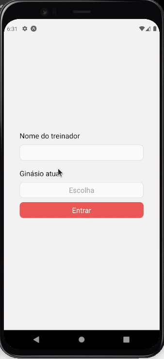

# Project
This project is an UI/UX design for Arlley Gomes. Using [PokeApi v2](https://pokeapi.co/docs/v2).

## 🚀 Techs
- [React](https://pt-br.reactjs.org/)
- [React Native](https://reactnative.dev/)
- [Typescript](https://www.typescriptlang.org/)
- [Expo](https://expo.io/)
- [Styled Components](https://styled-components.com/)
- [Context API](https://pt-br.reactjs.org/docs/context.html)
- [Axios](https://axios-http.com/)

# First demonstration

    

# Layout
You can see layout [here](https://www.behance.net/gallery/95262057/POKEDEX).

